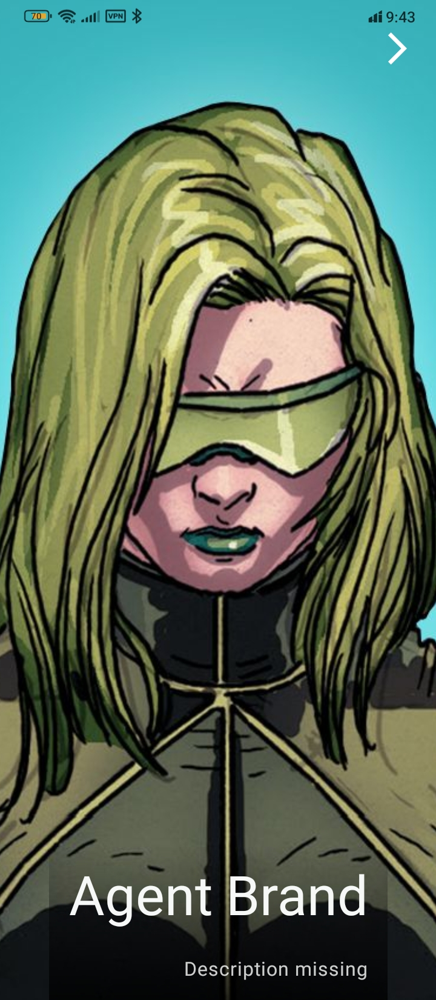
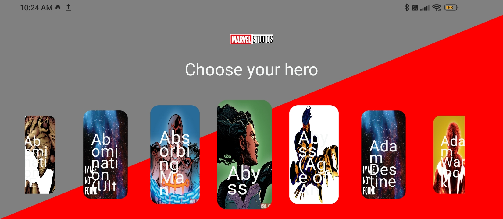
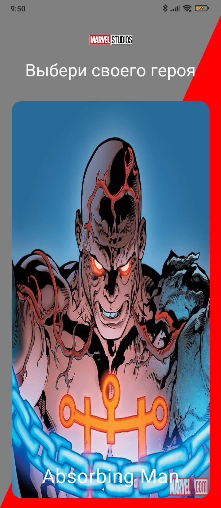
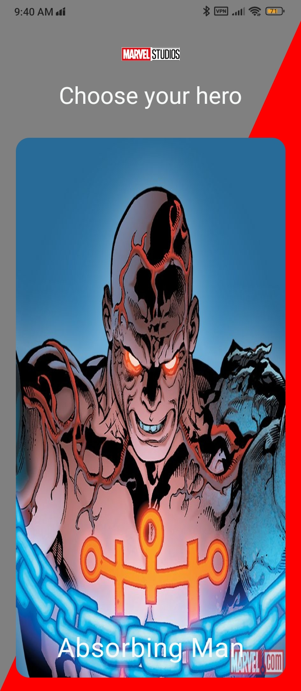
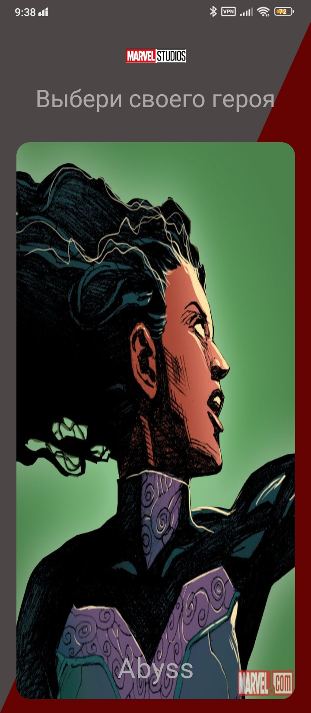
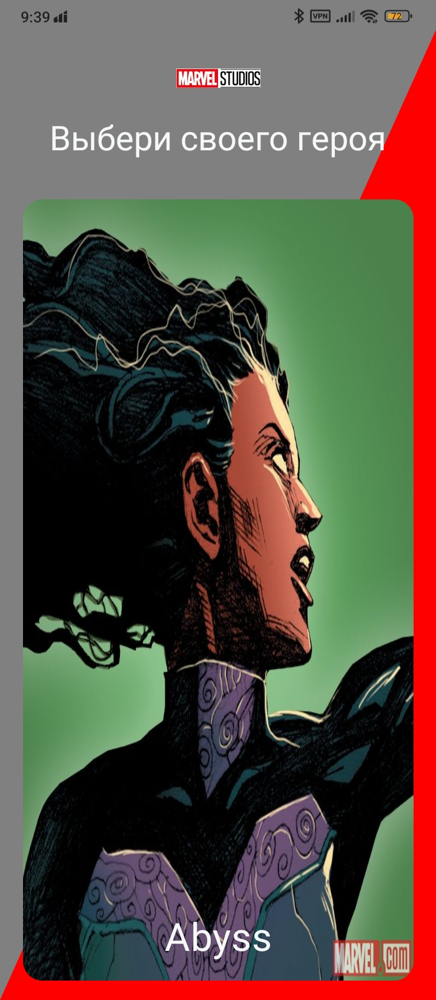
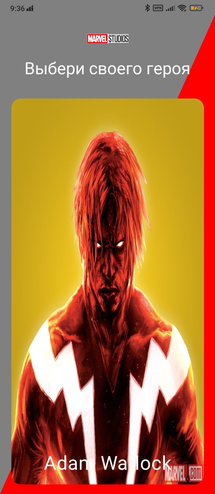
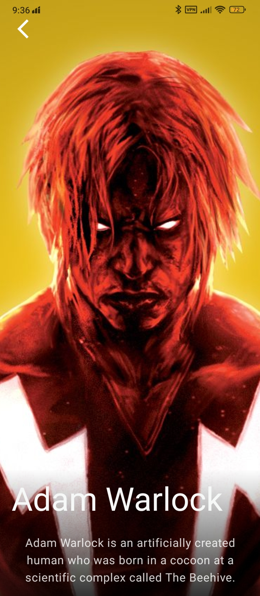

# Marvel Heroes App

 

An application for viewing information about characters in the Marvel universe with a clear and simple interface, created as an educational project to explore the stack of modern technologies.

# App Screenshots

<table>
  <tr>
    <td></td>
    <td></td>
  </tr>
</table>

**RTL (Right-to-Left) Interface Support**
#
  

**Implementation of Edge-to-Edge Design**
#
<table>
  <tr>
    <td></td>
    <td></td>
  </tr>
</table>

**Localization (English/Russian)**
#
<table>
  <tr>
    <td></td>
    <td></td>
  </tr>
</table>

**Dark/Light Theme**
#

<table>
  <tr>
    <td></td>
    <td></td>
  </tr>
</table>

**Preview and details**
#

## Features
- Dark/Light Theme with smooth animations
- Right-to-Left (RTL) layout support
- MVI architecture (state management)
- Edge-to-Edge design with transparent system bars
- Full localization (English and Russian)
- Intelligent Offline Mode with Room caching
- Marvel character browser with detail screen
## Tech Stack
- **Jetpack Compose** - Modern declarative UI framework
- **Dagger Hilt** - dependency injection
- **Room** - Local database persistence
- **Retrofit + OkHttp** -  API networking
- **Moshi** - JSON parsing
- **Marvel API** - Data source
- **Coil** -  Image loading
- **Coroutines + Flow** - Asynchronous operations
- **Navigation Compose** - In-app navigation
## Requirements
- Android 8.0+ (API 24)
- Kotlin 1.9.0+
- Android Studio Meerkat+
## Installation
1. Get API keys from [developer.marvel.com](https://developer.marvel.com/)
2. Add them to `local.properties` :
```
For example
MARVEL_PUBLIC_KEY="85366ee982e642d7957abb89a7559431"
MARVEL_PRIVATE_KEY=your_private_key
```
3. "Build the project using Android Studio"

## The API has certain limitations for developers.
- Rate limiting: ~3,000 requests/day (varies by authentication method)
- Attribution required: Must display Marvel copyright notice as specified in their terms
- Data caching: Results may not be stored for more than 24 hours
- Commercial use: Requires separate approval for commercial applications

## Contacts
[](https://t.me/omichfly)

## [Download Marvel Heroes](https://github.com/Siberia55/MarvelHeros/releases/tag/v1)

