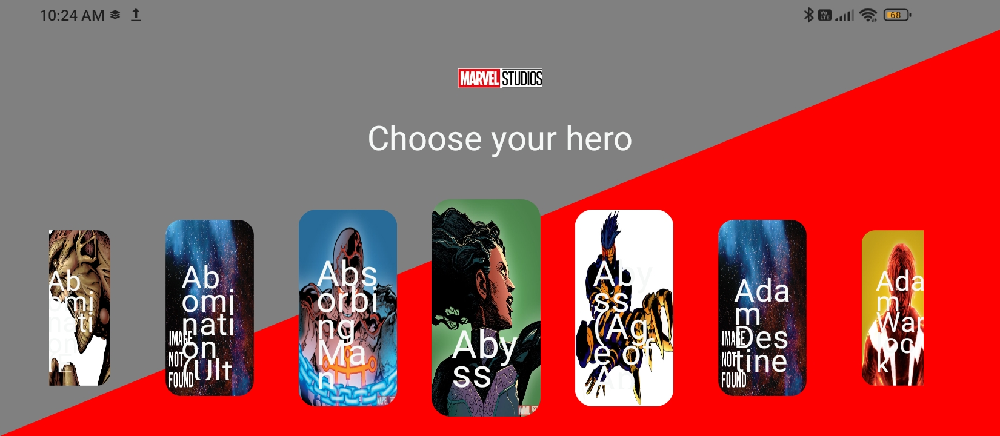
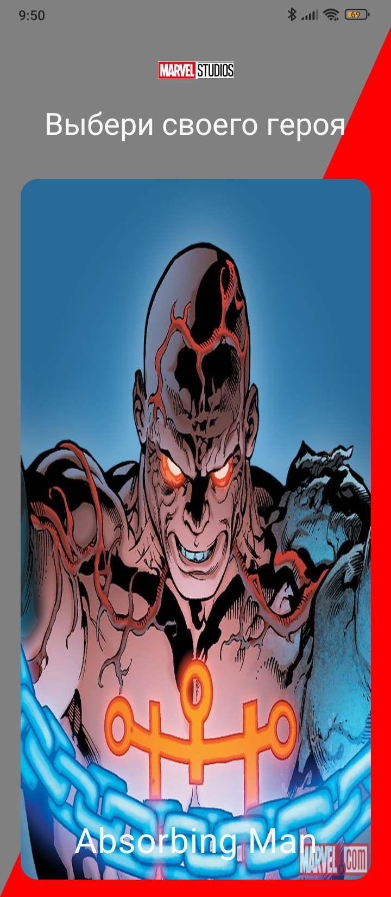
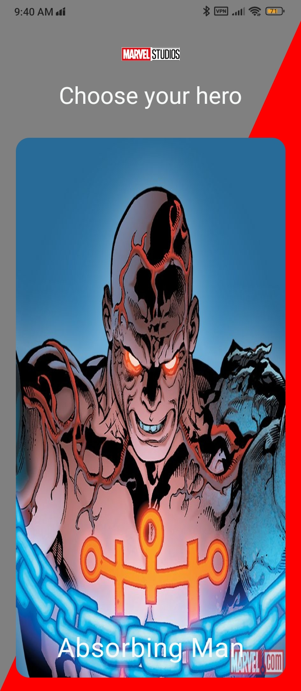
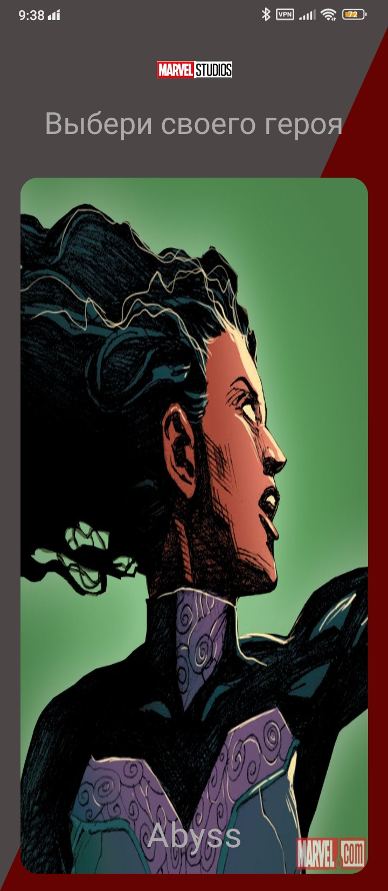
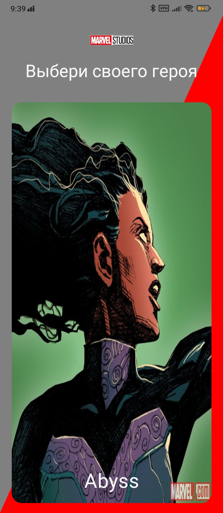

# Marvel Heroes App

 

An application for viewing information about Marvel Universe heroes with a clear and simple interface, created as an educational project to explore the stack of modern technologies.

# Скриншоты 

**RTL (Right-to-Left) interface support**
<table>
  <tr>
    <td></td>
    <td></td>
  </tr>
</table>

**Edge-to-edge design implementation**

  


**Localization (Russian/English)**
<table>
  <tr>
    <td></td>
    <td></td>
  </tr>
<table>

**Dark/Light theme**

<table>
  <tr>
    <td></td>
    <td></td>
  </tr>
<table>

- Smooth transition animations
- Offline mode with caching
- MVI architecture

##  Technologies
- **Jetpack Compose** - modern UI framework
- **Dagger Hilt** - dependency injection
- **Room** - local database
- **Retrofit + OkHttp** - API handling
- **Moshi** - JSON parsing
- **Marvel API** - data source
- **Coil** - image loading
- **Coroutines + Flow** - asynchronous operations
- **Navigation Compose** - navigation
 
## Requirements
- Android 8.0+ (API 24)
- Kotlin 1.9.0+
- Android Studio Meerkat+

## Installation
1. Get API keys at [developer.marvel.com](https://developer.marvel.com/)
2. Add to `local.properties` :
```
For example
MARVEL_PUBLIC_KEY="85366ee982e642d7957abb89a7559431"
MARVEL_PRIVATE_KEY=your_private_key
```
3.  Build the project via Android Studio

## The API has some developer limitations разработчиков

## Contacts

omichfly -  [My telegram](https://t.me/omichfly)

